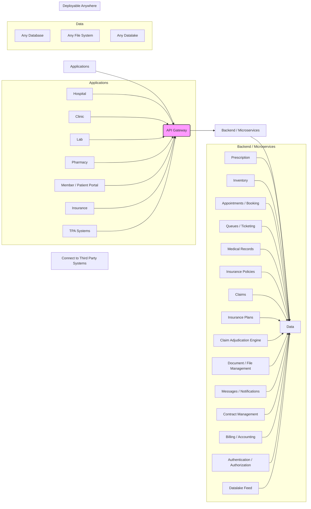
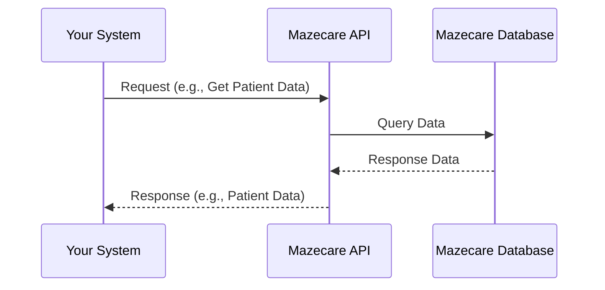

# Integrating with Mazecare: FAQ and Architectural Diagrams

This document provides a framework for creating a Frequently Asked Questions (FAQ) section and architectural diagrams for integrating with Mazecare (www.mazecare.com). Please replace the placeholder information with specific details from Mazecare's API documentation. You can find our API portal here: https://api-hk-dev.mazecare.com/graphql/

## General FAQ

* **Q: What are the benefits of integrating with Mazecare?**
    * A: Streamlined data exchange between all application using Mazecare as a backend
* **Q: What types of systems can integrate with Mazecare?**
    * A: EHR/EMR systems, Clinic Management Systems, Hospital Information Systems, patient applications, claim management systems, CRM systems, billing platforms, IoT devices, etc.)
* **Q: Does Mazecare provide an API for integration?**
    * A: Yes, Mazecare provides a complete GraphQL set of APIs. Currenctly more 700 apis (questies, mutations, subscriptions)
* **Q: What authentication methods does Mazecare use?**
    * A: OAuth 2.0 and Bearer JWT tokens
* **Q: Is there a developer portal or documentation available?**
    * A: Not yet, but we are currently building one
* **Q: Are webhooks supported?**
    * A: Not yet but we will build webhook capabilities if there is a need for it for any client.

## Technical FAQ

* **Q: What data formats does the Mazecare API use?**
    * A: JSON
* **Q: How do I handle authentication with the Mazecare API?**
    * A: You need to call the graphQL mutation `generateAccessToken` and insert the bearer token in the `Authorization` header
* **Q: What are the best practices for handling errors?**
    * A: Errors are handled and sent back to you using the standard GrahpQL format.
* **Q: Are there any code samples or SDKs available?**
    * A: Not yet but we will build webhook capabilities if there is a need for it for any client.

## Architectural Diagrams (Conceptual)

### 1. API Integration:

